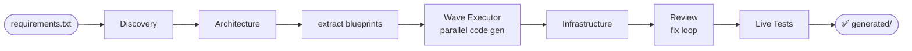
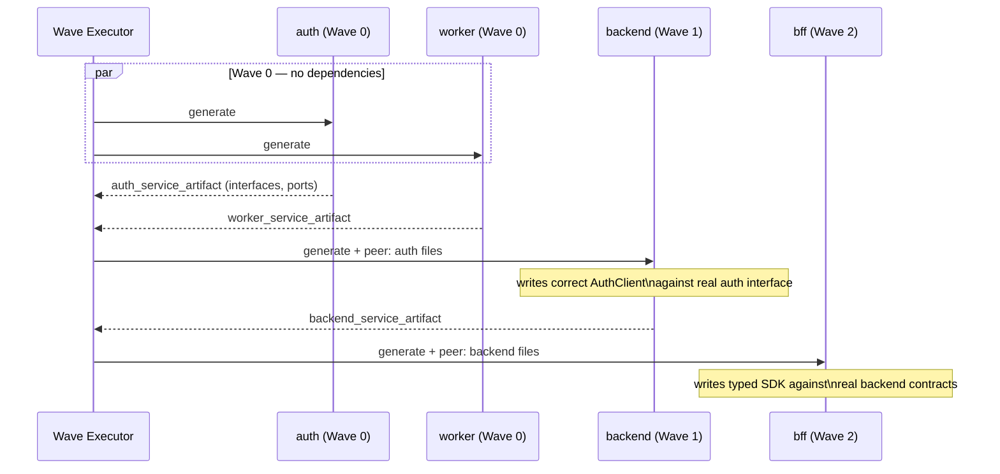
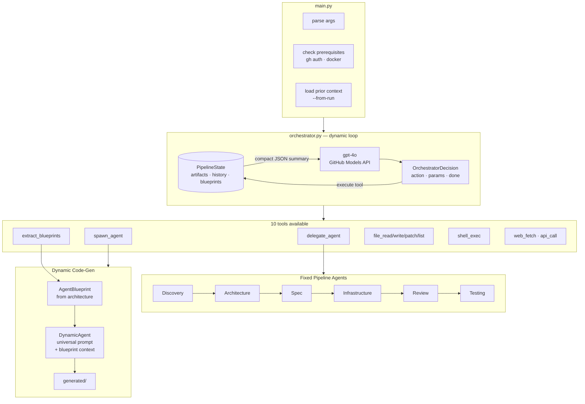
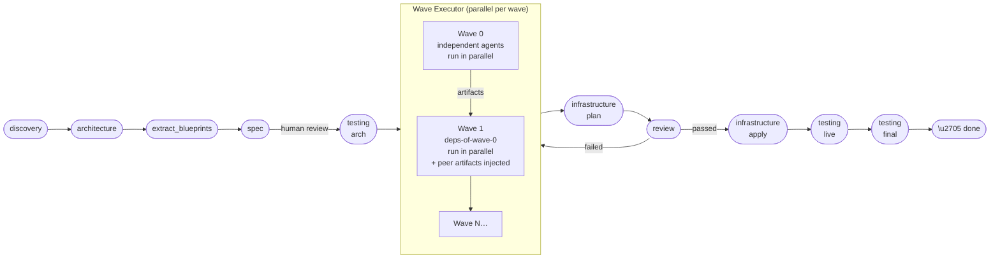
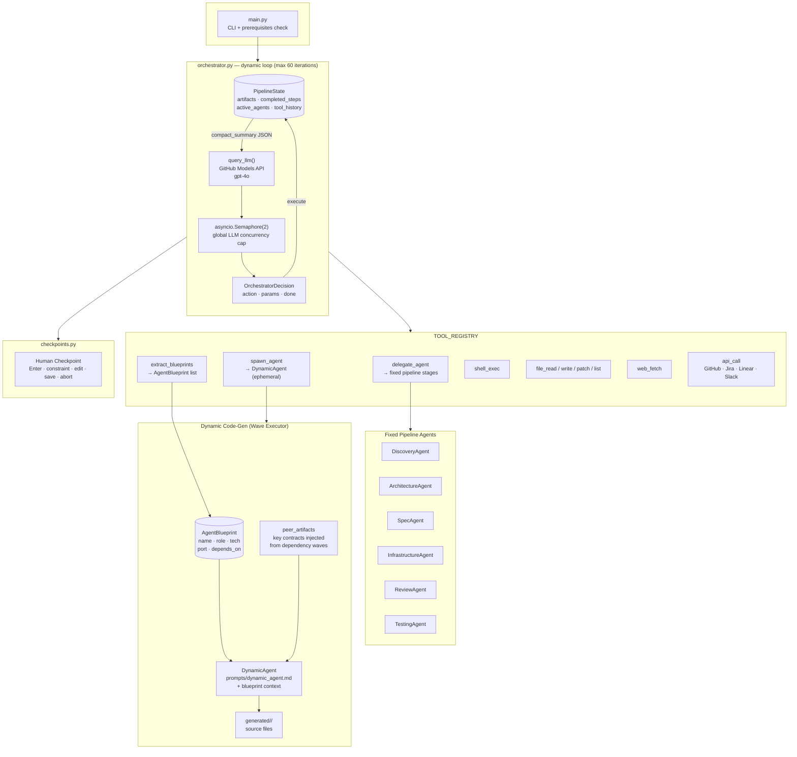
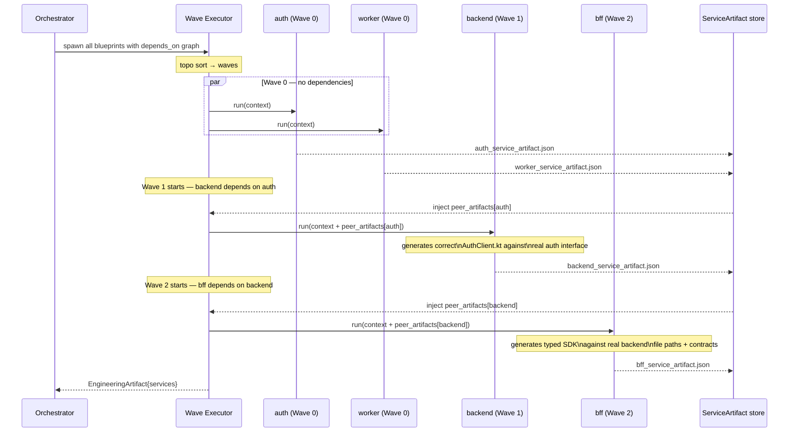

# Agentic SDLC

**Plain English in. Production code out.**

Describe what you want to build — in a text file, in any language, at any level of detail. The pipeline designs the architecture, writes all the code, containerises it, and tests it.

---

## Quickstart

```bash
git clone https://github.com/vb-nattamai/agentic-sdlc && cd agentic-sdlc
pip install -r requirements.txt
gh auth login
echo "Build a todo REST API in FastAPI with PostgreSQL" > reqs.txt
python3 main.py --requirements reqs.txt
```

---

## What gets generated

The pipeline adapts to whatever you describe. Examples:

| You write | What gets built |
|---|---|
| FastAPI todo API | Python FastAPI, PostgreSQL, Alembic, Docker Compose |
| React + Node.js dashboard | React 18 + TypeScript, Express, Prisma, Docker Compose |
| iOS app with a shared backend | SwiftUI, Kotlin Spring Boot API, PostgreSQL |
| Flutter app for iOS + Android | Flutter (Dart), Node.js API, MongoDB |
| gRPC microservices in Go | auth + user + product services, Protobuf definitions |
| AWS Lambda serverless API | Node.js Lambdas, API Gateway, DynamoDB, SAM template |
| Kubernetes app on EKS | Terraform, Helm charts, Deployments, HPA, Ingress |
| Django monolith | Django 5, DRF, Celery, Redis, PostgreSQL |
| Rust REST API | Axum, SQLx, PostgreSQL, Docker |
| CLI tool in Go | Cobra, cross-platform build scripts, tests |

Any language. Any framework. Any cloud.

---

## How it works

```
requirements.txt → Discovery → Architecture → Spec
                                                 ↓
                              Code gen (parallel, per service)
                                                 ↓
                              Infrastructure → Review → Deploy → Tests ✅
```

1. **Discovery** — structures your requirements into goals and constraints
2. **Architecture** — LLM designs the system; one blueprint per service
3. **Spec** — OpenAPI + SQL DDL generated → pipeline pauses for review
4. **Code gen** — each service generated in parallel; dependent services receive peer contracts automatically
5. **Infrastructure** — Dockerfiles + Docker Compose
6. **Review** — OWASP security scan + quality gate; auto-retries on failure
7. **Deploy + Test** — containers started, live HTTP tests run

---

## Prerequisites

- Python 3.11+
- Docker running locally
- [GitHub CLI](https://cli.github.com) authenticated with Models API access

---

## Common commands

```bash
# Basic run (pauses for human review at key stages)
python3 main.py --requirements reqs.txt

# Fully automated — no pauses
python3 main.py --requirements reqs.txt --auto

# Specify tech stack
python3 main.py --requirements reqs.txt \
  --tech-constraints "Go 1.22 only" \
  --arch-constraints "stateless, JWT auth"

# Add features to an existing project — no re-explaining needed
python3 main.py --from-run artifacts/run_... --requirements new_features.txt

# Resume after a pause or interruption
python3 main.py --resume artifacts/run_.../checkpoints/step_3.json --auto
```

All options: `python3 main.py --help`

---

## Output

```
artifacts/run_YYYYMMDD_HHMMSS/
├── PROJECT_CONTEXT.md        ← summary of everything built; use with --from-run
├── generated/
│   ├── <service>/            ← source code per service
│   ├── specs/openapi.yaml
│   └── docker-compose.yml
└── *_artifact.json           ← structured outputs from each pipeline stage
```

`PROJECT_CONTEXT.md` is written after every successful run. Pass its directory to `--from-run` on the next run to continue the project without re-explaining it.

---

## Human review

At key stages the pipeline pauses:

```
⏸  Human Review Required — Spec complete

  [Enter]          Continue
  c <text>         Inject a constraint  (e.g. c Use Redis not Memcached)
  e <name>         Edit an artifact
  s                Save and exit (resume later)
  a                Abort
```

Use `--auto` to skip all pauses.

---

## Customise behaviour

Edit the prompt files — no code changes needed:

| File | Controls |
|---|---|
| `prompts/dynamic_agent.md` | Code generation rules for all services |
| `prompts/architecture_agent.md` | System design and blueprint generation |
| `prompts/review_agent.md` | Security checklist and quality thresholds |
| `prompts/orchestrator.md` | Pipeline routing logic |

---

## Contributing

1. Fork + clone
2. Edit a prompt (`prompts/*.md`) or agent (`agents/*.py`)
3. Test: `python3 main.py --requirements test_requirements.txt --auto`
4. `pytest`
5. Open a PR

---

## Licence

MIT


---

## Quickstart

```bash
git clone https://github.com/vb-nattamai/agentic-sdlc && cd agentic-sdlc
pip install -r requirements.txt
gh auth login
echo "Build a REST API for a todo app in FastAPI with PostgreSQL" > reqs.txt
python3 main.py --requirements reqs.txt
```

That's it. Grab a coffee ☕ — the pipeline handles everything else.

---

## What Can I Build With This?

### Web Applications

| What you write | What gets generated |
|---|---|
| React dashboard with a Node.js API | React 18 + TypeScript, Express, Prisma, PostgreSQL, Docker Compose |
| Next.js SaaS with auth and billing | Next.js 14, tRPC, NextAuth.js, Stripe, PostgreSQL, Tailwind CSS |
| Vue admin panel with a FastAPI backend | Vue 3 + Pinia, Python FastAPI, SQLAlchemy, Alembic migrations |
| Angular app with Spring Boot | Angular 17, Kotlin Spring Boot 3, JPA, Flyway |
| Svelte app with a Go backend | SvelteKit, Go + Gin, GORM, PostgreSQL |

### Mobile Apps

| What you write | What gets generated |
|---|---|
| iOS todo app in SwiftUI with a REST backend | Swift + SwiftUI, Kotlin Spring Boot API, PostgreSQL |
| Android e-commerce app | Kotlin + Jetpack Compose, Go + Gin, Redis cache |
| Flutter social app for iOS and Android | Flutter (Dart), Node.js API, MongoDB, Firebase Push |
| React Native fitness tracker | React Native + Expo, Python FastAPI, InfluxDB |
| iOS + Android app sharing one backend | SwiftUI + Kotlin Android, shared Kotlin Spring Boot API |

### Backend & APIs

| What you write | What gets generated |
|---|---|
| GraphQL API for a blog in Node.js | Apollo Server, TypeScript, Prisma, PostgreSQL |
| gRPC microservices in Go | auth, user, product services in Go + Protobuf definitions |
| Python data pipeline for ETL | ingestion, transform, load workers, Airflow DAG |
| Rust REST API | Rust + Axum, SQLx, PostgreSQL, Docker |
| Ruby on Rails monolith | Rails 7, ActiveRecord, Sidekiq, Redis, PostgreSQL |
| Django REST Framework API | Python Django, DRF, Celery, Redis, PostgreSQL |
| Kotlin Spring Boot microservices | auth, orders, notifications services + API gateway |

### Infrastructure & Cloud

| What you write | What gets generated |
|---|---|
| AWS infrastructure with CDK | TypeScript CDK stacks, Lambda, DynamoDB, S3, API Gateway |
| Terraform for a Kubernetes cluster | Terraform modules, EKS/GKE config, Helm charts, Ingress |
| Kubernetes manifests for microservices | Deployments, Services, HPA, ConfigMaps, Secrets, Ingress |
| Docker Compose for a 5-service app | Dockerfiles per service, docker-compose.yml, health checks |
| Serverless API on AWS Lambda | Node.js Lambda functions, API Gateway, DynamoDB, SAM template |

### Other

| What you write | What gets generated |
|---|---|
| CLI tool in Python | Python + Click, subcommands, config file support, tests |
| CLI tool in Go | Go + Cobra, cross-platform build scripts |
| Event-driven system | Kafka producer + consumer, Spring Boot, PostgreSQL, dashboard |
| WebSocket real-time app | Node.js + Socket.io, React, Redis pub/sub |
| ML model serving API | FastAPI + Pydantic, model loading, prediction endpoints |

---

## How It Works

1. **Write a requirements file** — plain English, any length, any level of detail
2. **Discovery** — the pipeline structures your requirements into goals, constraints, and success criteria
3. **Architecture** — the LLM designs the system and produces one blueprint per service
4. **Spec** — OpenAPI + SQL DDL contract generated; pipeline pauses for your review
5. **Code generation** — each service is generated in parallel by a dedicated short-lived agent; dependent services automatically receive their peer's API contracts
6. **Infrastructure** — Dockerfiles and Docker Compose generated
7. **Review** — OWASP security scan + quality scoring; automatically retries if it fails
8. **Deploy & Test** — containers started, live HTTP tests run



The pipeline is **fully dynamic** — it never has a hardcoded list of agents or steps. The orchestrator LLM reads the current state after every action and decides what to do next.

---

## Prerequisites

- **Python 3.11+**
- **Docker** running locally
- **GitHub CLI** (`gh`) with [Models API access](https://github.com/marketplace/models)

```bash
pip install -r requirements.txt
gh auth login
```

---

## CLI Reference

```
python3 main.py [OPTIONS]

  --requirements FILE    Requirements text file (default: requirements.txt)
  --interactive          Type requirements at the terminal
  --auto                 Skip all human checkpoints (CI/CD mode)
  --model STR            LLM model override (default: gpt-4o)
  --output-dir DIR       Where to write all artifacts
  --tech-constraints STR e.g. "Kotlin 1.9 only, no Scala"
  --arch-constraints STR e.g. "stateless services, JWT auth"
  --from-run DIR         Extend an existing project — all prior context loaded
  --resume FILE          Resume from a saved checkpoint
  --config FILE          Load settings from pipeline.yaml
  --spec FILE            Include an existing spec file (repeatable)
```

### Common patterns

```bash
# Standard run — pauses for review at key stages
python3 main.py --requirements reqs.txt

# Fully automatic, no pauses (CI/CD)
python3 main.py --requirements reqs.txt --auto

# Specify the tech stack
python3 main.py --requirements reqs.txt \
  --tech-constraints "Go 1.22 only, no Node.js" \
  --arch-constraints "stateless services, JWT, no sessions"

# Add features to an existing project (no re-explaining needed)
python3 main.py \
  --from-run artifacts/run_20260318_120000 \
  --requirements new_features.txt

# Resume after a checkpoint or Ctrl+C
python3 main.py --resume artifacts/run_.../checkpoints/step_3.json

# Use a config file (see pipeline.yaml)
python3 main.py --config my_project.yaml
```

---

## Output

Every run creates a timestamped directory:

```
artifacts/run_YYYYMMDD_HHMMSS/
│
├── PROJECT_CONTEXT.md          ← human-readable summary of everything built
│                                  use with --from-run to extend the project
├── generated/
│   ├── <service>/              ← one directory per service (backend, frontend, …)
│   ├── specs/
│   │   ├── openapi.yaml
│   │   └── schema.sql
│   └── docker-compose.yml
│
├── 01_discovery_artifact.json
├── 02_architecture_artifact.json
├── 04_generated_spec_artifact.json
├── <name>_service_artifact.json  (one per service)
└── ...
```

**`PROJECT_CONTEXT.md`** is the most important output file. It captures everything — architecture decisions, technology choices, API contracts, quality scores — in a readable format. Open it to understand what was built, or pass the directory to `--from-run` to continue where you left off.

---

## Extending a Project (Context-Aware Runs)

After every run, `PROJECT_CONTEXT.md` is written automatically. When you use `--from-run`, ALL previous artifacts are loaded — the pipeline sees what was already built and skips straight to adding what's new.

```bash
# First run — builds a todo API from scratch
python3 main.py \
  --requirements "Build a todo API in FastAPI with user accounts" \
  --output-dir artifacts/my_todo_project

# Second run — add a feature without re-describing the whole project
python3 main.py \
  --from-run artifacts/my_todo_project \
  --requirements "Add email notifications when a task is assigned to a user"
```

The second run loads the prior discovery, architecture, spec, and all service artifacts. The orchestrator sees these are already complete and jumps straight to the new notification service — no redundant work.

---

## Human Control Points

At key stages the pipeline pauses and shows:

```
⏸  Human Review Required
──────────────────────────────────────────
Reason: Spec complete — API contract ready for review
Proposed: delegate_agent / testing

Commands:
  [Enter]              Continue
  c <text>             Inject a constraint  (e.g. c Use Redis not Memcached)
  e <artifact-name>    Edit an artifact directly
  s                    Save state and exit  (resumable later with --resume)
  a                    Abort immediately
```

Use `--auto` to skip all pauses.

---

## Customising Agent Behaviour

All agent behaviour is in markdown prompt files — no code changes needed:

| File | Controls |
|---|---|
| `prompts/orchestrator.md` | Overall routing logic and stage ordering |
| `prompts/discovery_agent.md` | How requirements are parsed |
| `prompts/architecture_agent.md` | System design rules and blueprint generation |
| `prompts/spec_agent.md` | OpenAPI and SQL DDL generation |
| `prompts/dynamic_agent.md` | Code generation rules for ALL services |
| `prompts/review_agent.md` | Security checklist and quality thresholds |
| `prompts/testing_agent.md` | Test strategy |
| `prompts/infrastructure_agent.md` | Docker and IaC rules |

---

## How It Differs From a Prompt Chain

| Hardcoded prompt chain | Agentic SDLC |
|---|---|
| Fixed agents: backend, bff, frontend | Agents derived from architecture — any stack, any count |
| Fixed sequence: step 1 → 2 → 3 | Orchestrator decides next action from current state |
| No recovery from failures | Detects loops, injects constraints, retries intelligently |
| No human control | Meaningful pauses with constraint injection and artifact editing |
| Cannot fix its own code | Review → fix → redeploy loop until quality gate passes |
| Re-runs from scratch | `--from-run` loads all prior context; skips completed stages |

---

## Architecture (For the Curious)

### Wave-Based Parallel Code Generation

The pipeline groups services into execution waves based on their dependencies. Services in the same wave run in parallel. When a wave completes, the next wave starts and receives the actual generated files (API interfaces, protobuf definitions, typed clients) from its dependencies — so a BFF agent can generate the exact HTTP client for the backend it depends on.



### System Components



---

## Contributing

1. Fork + clone
2. Edit a prompt file (`prompts/*.md`) or agent (`agents/*.py`)
3. Test: `python3 main.py --requirements test_requirements.txt --auto`
4. Run tests: `pytest`
5. Open a pull request

---

## Licence

MIT


Unlike hardcoded prompt chains, Agentic SDLC uses an orchestrator LLM that reads the
full pipeline state after every tool call and decides what to do next. Crucially,
**no specialist code-generation agents are hardcoded**. The orchestrator first asks the
architecture agent to design the system, then synthesises short-lived **dynamic agents**
whose number, technology stack, and responsibilities are derived entirely from that
architecture. Nothing is predetermined — the flow is driven by reasoning about the
current state.

---

## Core Idea — Architecture-Driven Agent Spawning


Each `DynamicAgent` is synthesised at runtime from a single universal base prompt
(`prompts/dynamic_agent.md`) combined with a blueprint that describes the specific
service — its role, technology stack, port, and extra instructions. The agent is
discarded once it has written its files.

---

## What It Builds

The pipeline output depends on what the architecture agent decides, not on what is
hardcoded. For a typical full-stack web application it might produce:

| Output | Location |
|--------|----------|
| Service code (stack determined by architecture) | `generated/<blueprint.output_subdir>/` |
| OpenAPI 3.0 spec + SQL DDL | `generated/specs/` |
| Docker Compose + per-service Dockerfiles | `generated/` |
| Cypress e2e tests | `generated/cypress/` |
| README, AGENTS.md, .cursorrules | `generated/` |

Examples of what different requirements might spawn:

| Requirements | Dynamic Agents Spawned |
|--------------|------------------------|
| Full-stack web app | `backend` (Spring Boot) · `bff` (WebFlux) · `frontend` (React) |
| CLI data pipeline | `ingestion` (Python) · `processor` (Python) · `reporter` (Python) |
| Event-driven system | `producer` (Kafka + Spring) · `consumer` (Spring) · `dashboard` (React) |
| Microservices API | `auth_service` · `order_service` · `notification_service` |

---

## How It Differs From a Hardcoded Pipeline

| Hardcoded Prompt Chain | Agentic SDLC |
|------------------------|--------------|
| Fixed agents: backend, bff, frontend | Agents derived from architecture; any stack, any count |
| Fixed sequence: step 1 → step 2 → step 3 | Orchestrator decides next action from state |
| No recovery from failures | Detects loops, injects constraints, retries intelligently |
| No human control points | Meaningful human checkpoints with constraint injection |
| Cannot fix its own output | Review→fix→redeploy loop until quality gate passes |
| No context between steps | Full state summary passed to orchestrator every iteration |

---

## Prerequisites

- **Python 3.11+**
- **Docker** (Desktop or Engine) running locally
- **GitHub CLI** (`gh`) authenticated with a Copilot or Models API licence
- **Node 18+** (only if running Cypress tests locally outside Docker)

Install the GitHub CLI: https://cli.github.com

---

## Installation

```bash
git clone <this-repo>
cd agentic_sdlc
pip install -r requirements.txt
gh auth login   # if not already authenticated
```

---

## Quick Start

```bash
# Write your requirements to a text file
echo "Build a todo list app with user accounts and task management" > my_reqs.txt

# Run the pipeline
python3 main.py --requirements my_reqs.txt
```

The pipeline will:
1. Parse and structure your requirements
2. Design the architecture
3. Generate an OpenAPI + SQL contract → **pauses for human review**
4. Generate all source code (backend, BFF, frontend) concurrently
5. Generate Docker infrastructure
6. Run a security and quality review → fix loop if needed
7. Build and deploy containers
8. Run live HTTP tests
9. Confirm all requirements are met

---

## All CLI Flags

```
python3 main.py [OPTIONS]

Input:
  --requirements FILE    Path to requirements text file (default: requirements.txt)
  --interactive          Enter requirements at the terminal (end with Ctrl+D)

Configuration:
  --config FILE          Load settings from pipeline.yaml
  --tech-constraints STR Technology constraints (e.g. "Kotlin 1.9 only, no Scala")
  --arch-constraints STR Architectural constraints (e.g. "stateless, JWT auth")
  --model STR            LLM model override (default: gpt-4o or PIPELINE_MODEL env)

Output:
  --output-dir DIR       Output directory (default: artifacts/run_YYYYMMDD_HHMMSS)

Pipeline control:
  --auto                 Skip all human checkpoints (CI/CD mode)
  --resume FILE          Resume from a saved checkpoint JSON file

Incremental development:
  --spec FILE            Pass an existing spec file (repeatable)
  --from-run DIR         Load existing OpenAPI + DDL from a previous run.
                         All existing paths will be marked x-existing: true.
```

### Examples

```bash
# Fully automatic (CI/CD)
python3 main.py --requirements reqs.txt --auto

# Custom model
python3 main.py --requirements reqs.txt --model gpt-4o

# With constraints
python3 main.py --requirements reqs.txt \
  --tech-constraints "Kotlin 1.9, no Scala" \
  --arch-constraints "stateless services, JWT only, no sessions"

# Interactive requirements entry
python3 main.py --interactive

# Use a config file
python3 main.py --config my_pipeline.yaml

# Resume a paused run
python3 main.py --resume artifacts/run_20260318_120000/checkpoints/step_3.json

# Incremental mode — extend an existing project
python3 main.py --from-run artifacts/run_20260318_120000 --requirements new_features.txt
```

---

## Pipeline Flow



---

## How the Orchestrator Loop Works

Every pipeline iteration:

1. The current `PipelineState` is serialised to a compact JSON summary including:
   - Which steps have completed
   - Active agent blueprints (name, role, technology, port, output_subdir, depends_on)
   - Which artifacts are available
   - The last 8 tool calls and their results
   - Any injected constraints
   - Failed attempt counts

2. This summary is sent to the orchestrator LLM with a system prompt that explains:
   - All available tools and their signatures
   - Fixed pipeline stages (discovery, architecture, spec, review, testing, infrastructure)
   - Dynamic routing rules — how to call `extract_blueprints` and `spawn_agent`
   - Human review trigger conditions

3. The LLM returns a single JSON decision:
   ```json
   {
     "reasoning": "architecture has 3 services; spawning backend next",
     "action": "spawn_agent",
     "params": {
       "blueprint": { "name": "backend", "role": "REST API", "technology": "Kotlin + Spring Boot 3.3", ... },
       "context": { "spec": {...}, "constraints": {...} },
       "output_dir": "artifacts/run_..."
     },
     "requires_human_review": false,
     "done": false
   }
   ```

4. The orchestrator executes the tool, records the result, saves state, and loops.

The LLM is never told "run step 3 next" — it figures out what step 3 is by
reading what has already been done. It is never told "spawn a backend agent" —
it derives which agents to spawn by reading `state.active_agents`.

---

## Dynamic Agent Architecture — Key Concepts

### `AgentBlueprint`

Produced by the architecture agent and stored in `state.active_agents`. Describes
everything a short-lived agent needs to know about the service it must generate:

```python
class AgentBlueprint(BaseModel):
    name: str               # snake_case, e.g. "backend", "worker", "graphql_gateway"
    role: str               # one sentence, e.g. "REST API serving mobile clients"
    technology: str         # e.g. "Kotlin 1.9 + Spring Boot 3.3 + Gradle + JPA"
    port: int | None        # container port, e.g. 8081
    output_subdir: str      # directory under generated/, e.g. "backend"
    artifact_schema: str    # always "ServiceArtifact"
    extra_instructions: list[str]  # additional rules for this service only
    depends_on: list[str]   # other blueprint names this service depends on
```

### `extract_blueprints` tool

Called once after the architecture agent completes. The LLM reads
`architecture.components`, decides which components require code generation,
and returns a validated `AgentBlueprint` array. This is **the only place** where
the list of code-generation agents is decided.

### `spawn_agent` tool

Called once per blueprint. Each call:
1. Validates the blueprint dict → `AgentBlueprint`
2. Instantiates a `DynamicAgent` with a synthesised system prompt
3. Runs the agent — two-phase file generation (plan → fill concurrently)
4. Writes all files to `generated/<output_subdir>/`
5. Saves `<name>_service_artifact.json` and returns `ServiceArtifact`

The agent object is discarded after the call completes. No state leaks between
services.

### `DynamicAgent`

Built from `prompts/dynamic_agent.md` (universal base rules) plus a blueprint
context block appended at runtime:

```
## THIS AGENT'S BLUEPRINT
name: backend
role: REST API serving mobile clients
technology: Kotlin 1.9 + Spring Boot 3.3 + Gradle + JPA
port: 8081
output_subdir: backend
extra_instructions:
  - Use JWT for all authenticated endpoints
  - Expose /actuator/health
```

The prompt is not loaded from disk for a hardcoded agent type — it is
**constructed at runtime** from the universal template + the blueprint.

---

When the pipeline pauses for human review, you see:

```
⏸  Human Review Required
────────────────────────────────────────
Reason: Spec agent completed — API contract ready for review

Proposed next action: delegate_agent
    { "agent_name": "testing", ... }

Completed steps:
  ✓ discovery
  ✓ architecture
  ✓ spec

Available artifacts:
  • discovery
  • architecture
  • spec

Commands:
  [Enter]   → Continue
  c <text>  → Inject constraint and continue
  e <name>  → Edit artifact by name
  s         → Save state and abort (resumable)
  a         → Abort immediately
```

| Command | Effect |
|---------|--------|
| `[Enter]` | Proceed with the proposed action |
| `c Use PostgreSQL not MySQL` | Inject that as a constraint; orchestrator re-plans |
| `e spec` | Opens the spec artifact in `/tmp/edit_spec.json`, waits for you to edit and press Enter, then reloads |
| `s` | Prints resume command and exits cleanly |
| `a` | Hard abort |

---

## Incremental Development (`--from-run`)

If you have an existing running system and want to add features:

```bash
python3 main.py \
  --from-run artifacts/run_20260318_120000 \
  --requirements new_features.txt
```

The pipeline will:
1. Load the existing `openapi.yaml` from the previous run
2. Pass it to the SpecAgent which must preserve all existing paths
3. Existing paths are marked `x-existing: true` in the new spec
4. Only generate code for NEW/changed paths
5. Engineering agents receive `target_services` to skip unchanged services

---

## Output Structure

```
artifacts/run_YYYYMMDD_HHMMSS/
├── orchestrator_state.json              # Full state, saved after every iteration
│                                          includes active_agents blueprint list
├── checkpoints/                         # One JSON per human pause point
│   └── step_{N}.json
├── 01_discovery_artifact.json
├── 02_architecture_artifact.json        # includes agent_blueprints list
├── 03_generated_spec_artifact.json
├── <name>_service_artifact.json × N     # one per DynamicAgent (e.g. backend, worker)
├── review_artifact.json
├── testing_architecture_artifact.json
├── testing_live_artifact.json
├── testing_final_artifact.json
├── infrastructure_plan_artifact.json
├── infrastructure_apply_artifact.json
└── generated/
    ├── <output_subdir>/   × N           # one per blueprint (e.g. backend/, worker/)
    ├── specs/
    │   ├── openapi.yaml
    │   └── schema.sql
    ├── cypress/
    └── docker-compose.yml
```

---

## Customising Agent Behaviour

### Fixed pipeline stages
Each fixed agent reads its system prompt from `prompts/<agent_name>.md`.
Edit the markdown file — no code changes needed.

| Prompt File | Controls |
|-------------|----------|
| `prompts/orchestrator.md` | When to review, when to retry, `extract_blueprints` / `spawn_agent` routing rules |
| `prompts/discovery_agent.md` | How requirements are extracted and structured |
| `prompts/architecture_agent.md` | Architecture design rules — **and** how `agent_blueprints` are produced |
| `prompts/spec_agent.md` | OpenAPI spec generation rules |
| `prompts/infrastructure_agent.md` | Docker and IaC rules |
| `prompts/review_agent.md` | Security checklist and scoring |
| `prompts/testing_agent.md` | Test case generation strategy |

### Dynamic agents
All dynamic agents share a single universal base prompt:

| Prompt File | Controls |
|-------------|----------|
| `prompts/dynamic_agent.md` | Phase 1/2 generation rules, code quality standards, `ServiceArtifact` output schema |

To change how **all** dynamic agents behave, edit `prompts/dynamic_agent.md`.
To add service-specific rules for one agent, add them to `extra_instructions`
inside the blueprint — either in `prompts/architecture_agent.md` or by injecting
a constraint at a human checkpoint.

### Adding a new fixed pipeline stage

1. Create `agents/my_agent.py` with a class extending `BaseAgent`
2. Add `"my_agent": MyAgent` to `AGENT_MAP` in `tools/registry.py`
3. Create `prompts/my_agent.md`
4. Add the new stage name to `prompts/orchestrator.md` under `AVAILABLE AGENT NAMES`

---

## Environment Variables

| Variable | Default | Description |
|----------|---------|-------------|
| `PIPELINE_MODEL` | `gpt-4o` | LLM model (overridden by `--model`) |
| `APP_JWT_SECRET` | (from docker-compose) | JWT signing secret for generated app |
| `JIRA_URL` | — | JIRA base URL (for api_call tool) |
| `JIRA_TOKEN` | — | JIRA Bearer token |
| `LINEAR_TOKEN` | — | Linear API token |
| `SLACK_TOKEN` | — | Slack Bot token |

---

## Roadmap

Future specialist agents planned for this pipeline:

| Agent | Purpose |
|-------|---------|
| `DatabaseAgent` | Flyway/Liquibase migration scripts, seed data, ER diagrams |
| `ObservabilityAgent` | Micrometer metrics, OpenTelemetry tracing, structured logging |
| `DeploymentAgent` | Kubernetes manifests, Helm charts, ArgoCD config |
| `DocumentationAgent` | Auto-generate API docs, user guides, and ADRs |
| `PerformanceAgent` | k6/Gatling load tests, profiling recommendations |
| `ComplianceAgent` | GDPR, SOC2, HIPAA compliance checks on generated code |
| `SecurityScanAgent` | SAST (Semgrep), DAST (OWASP ZAP), dependency scanning |
| `MaintenanceAgent` | Dependency version updates, tech-debt tracking |

Because agents are spawned dynamically, any of the above can be introduced by:
1. Adding the agent to the architecture prompt's blueprint generation rules, or
2. Implementing it as a fixed stage via `delegate_agent`

No changes to the orchestrator loop are required.

---

## Architecture

### System Overview



### Wave-Based Parallel Execution



All LLM calls go through `agents/base_agent.py:query_llm()` which:
- Uses `asyncio.Semaphore(2)` to cap concurrent calls globally
- Retries up to 3 times with 5 s back-off on rate limit or timeout
- Points to `https://models.inference.ai.azure.com` (GitHub Models endpoint)
- Authenticates via `gh auth token`

---

## Contributing

1. Fork the repository
2. Create a feature branch
3. Edit the relevant `prompts/*.md` file or `agents/*.py`
4. Test with a simple requirements file: `python3 main.py --requirements test_reqs.txt`
5. Open a pull request

---

## Licence

MIT
