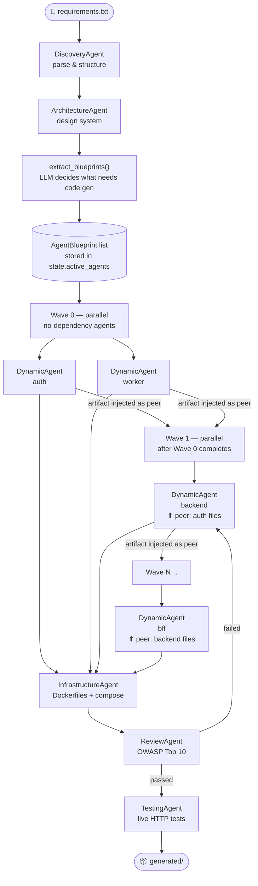
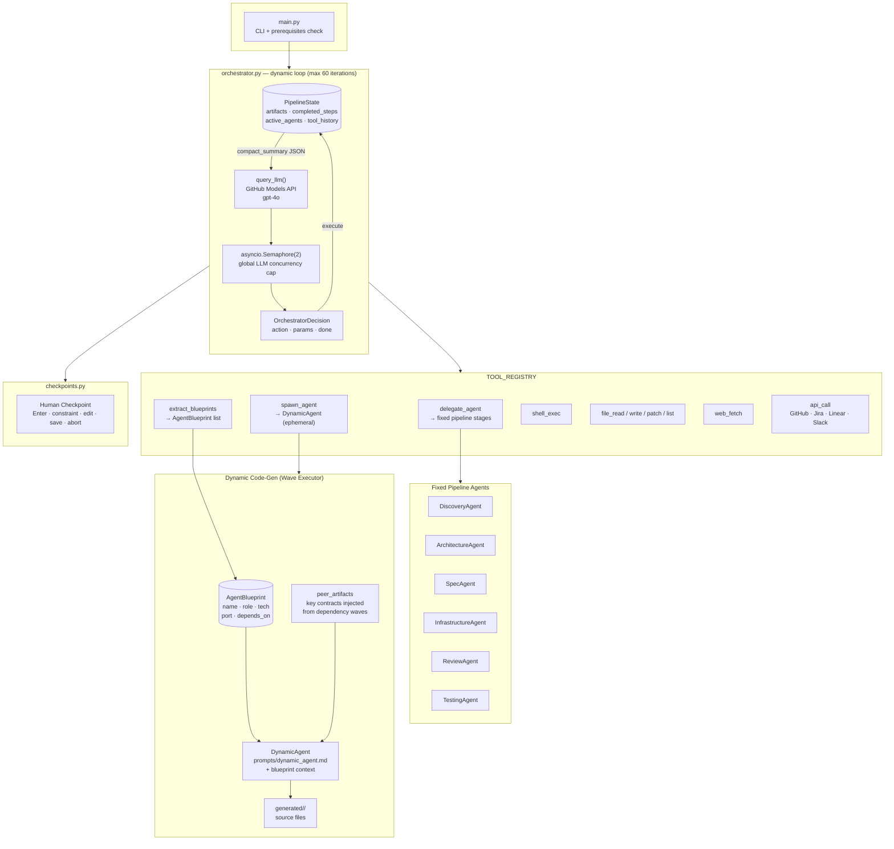
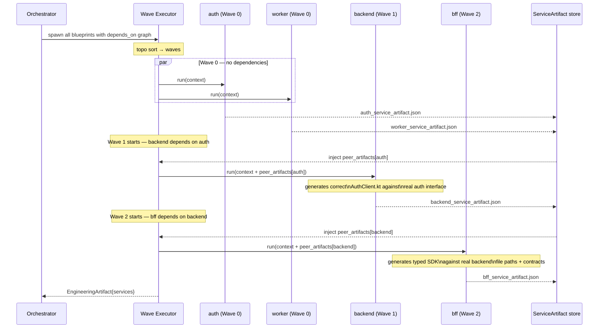

# Agentic SDLC

A **fully dynamic, LLM-orchestrated software development pipeline** that generates
a containerised application — of any shape — from a plain-English requirements file.

Unlike hardcoded prompt chains, Agentic SDLC uses an orchestrator LLM that reads the
full pipeline state after every tool call and decides what to do next. Crucially,
**no specialist code-generation agents are hardcoded**. The orchestrator first asks the
architecture agent to design the system, then synthesises short-lived **dynamic agents**
whose number, technology stack, and responsibilities are derived entirely from that
architecture. Nothing is predetermined — the flow is driven by reasoning about the
current state.

---

## Core Idea — Architecture-Driven Agent Spawning



Each `DynamicAgent` is synthesised at runtime from a single universal base prompt
(`prompts/dynamic_agent.md`) combined with a blueprint that describes the specific
service — its role, technology stack, port, and extra instructions. The agent is
discarded once it has written its files.

---

## What It Builds

The pipeline output depends on what the architecture agent decides, not on what is
hardcoded. For a typical full-stack web application it might produce:

| Output | Location |
|--------|----------|
| Service code (stack determined by architecture) | `generated/<blueprint.output_subdir>/` |
| OpenAPI 3.0 spec + SQL DDL | `generated/specs/` |
| Docker Compose + per-service Dockerfiles | `generated/` |
| Cypress e2e tests | `generated/cypress/` |
| README, AGENTS.md, .cursorrules | `generated/` |

Examples of what different requirements might spawn:

| Requirements | Dynamic Agents Spawned |
|--------------|------------------------|
| Full-stack web app | `backend` (Spring Boot) · `bff` (WebFlux) · `frontend` (React) |
| CLI data pipeline | `ingestion` (Python) · `processor` (Python) · `reporter` (Python) |
| Event-driven system | `producer` (Kafka + Spring) · `consumer` (Spring) · `dashboard` (React) |
| Microservices API | `auth_service` · `order_service` · `notification_service` |

---

## How It Differs From a Hardcoded Pipeline

| Hardcoded Prompt Chain | Agentic SDLC |
|------------------------|--------------|
| Fixed agents: backend, bff, frontend | Agents derived from architecture; any stack, any count |
| Fixed sequence: step 1 → step 2 → step 3 | Orchestrator decides next action from state |
| No recovery from failures | Detects loops, injects constraints, retries intelligently |
| No human control points | Meaningful human checkpoints with constraint injection |
| Cannot fix its own output | Review→fix→redeploy loop until quality gate passes |
| No context between steps | Full state summary passed to orchestrator every iteration |

---

## Prerequisites

- **Python 3.11+**
- **Docker** (Desktop or Engine) running locally
- **GitHub CLI** (`gh`) authenticated with a Copilot or Models API licence
- **Node 18+** (only if running Cypress tests locally outside Docker)

Install the GitHub CLI: https://cli.github.com

---

## Installation

```bash
git clone <this-repo>
cd agentic_sdlc
pip install -r requirements.txt
gh auth login   # if not already authenticated
```

---

## Quick Start

```bash
# Write your requirements to a text file
echo "Build a todo list app with user accounts and task management" > my_reqs.txt

# Run the pipeline
python3 main.py --requirements my_reqs.txt
```

The pipeline will:
1. Parse and structure your requirements
2. Design the architecture
3. Generate an OpenAPI + SQL contract → **pauses for human review**
4. Generate all source code (backend, BFF, frontend) concurrently
5. Generate Docker infrastructure
6. Run a security and quality review → fix loop if needed
7. Build and deploy containers
8. Run live HTTP tests
9. Confirm all requirements are met

---

## All CLI Flags

```
python3 main.py [OPTIONS]

Input:
  --requirements FILE    Path to requirements text file (default: requirements.txt)
  --interactive          Enter requirements at the terminal (end with Ctrl+D)

Configuration:
  --config FILE          Load settings from pipeline.yaml
  --tech-constraints STR Technology constraints (e.g. "Kotlin 1.9 only, no Scala")
  --arch-constraints STR Architectural constraints (e.g. "stateless, JWT auth")
  --model STR            LLM model override (default: gpt-4o or PIPELINE_MODEL env)

Output:
  --output-dir DIR       Output directory (default: artifacts/run_YYYYMMDD_HHMMSS)

Pipeline control:
  --auto                 Skip all human checkpoints (CI/CD mode)
  --resume FILE          Resume from a saved checkpoint JSON file

Incremental development:
  --spec FILE            Pass an existing spec file (repeatable)
  --from-run DIR         Load existing OpenAPI + DDL from a previous run.
                         All existing paths will be marked x-existing: true.
```

### Examples

```bash
# Fully automatic (CI/CD)
python3 main.py --requirements reqs.txt --auto

# Custom model
python3 main.py --requirements reqs.txt --model gpt-4o

# With constraints
python3 main.py --requirements reqs.txt \
  --tech-constraints "Kotlin 1.9, no Scala" \
  --arch-constraints "stateless services, JWT only, no sessions"

# Interactive requirements entry
python3 main.py --interactive

# Use a config file
python3 main.py --config my_pipeline.yaml

# Resume a paused run
python3 main.py --resume artifacts/run_20260318_120000/checkpoints/step_3.json

# Incremental mode — extend an existing project
python3 main.py --from-run artifacts/run_20260318_120000 --requirements new_features.txt
```

---

## Pipeline Flow


---

## How the Orchestrator Loop Works

Every pipeline iteration:

1. The current `PipelineState` is serialised to a compact JSON summary including:
   - Which steps have completed
   - Active agent blueprints (name, role, technology, port, output_subdir, depends_on)
   - Which artifacts are available
   - The last 8 tool calls and their results
   - Any injected constraints
   - Failed attempt counts

2. This summary is sent to the orchestrator LLM with a system prompt that explains:
   - All available tools and their signatures
   - Fixed pipeline stages (discovery, architecture, spec, review, testing, infrastructure)
   - Dynamic routing rules — how to call `extract_blueprints` and `spawn_agent`
   - Human review trigger conditions

3. The LLM returns a single JSON decision:
   ```json
   {
     "reasoning": "architecture has 3 services; spawning backend next",
     "action": "spawn_agent",
     "params": {
       "blueprint": { "name": "backend", "role": "REST API", "technology": "Kotlin + Spring Boot 3.3", ... },
       "context": { "spec": {...}, "constraints": {...} },
       "output_dir": "artifacts/run_..."
     },
     "requires_human_review": false,
     "done": false
   }
   ```

4. The orchestrator executes the tool, records the result, saves state, and loops.

The LLM is never told "run step 3 next" — it figures out what step 3 is by
reading what has already been done. It is never told "spawn a backend agent" —
it derives which agents to spawn by reading `state.active_agents`.

---

## Dynamic Agent Architecture — Key Concepts

### `AgentBlueprint`

Produced by the architecture agent and stored in `state.active_agents`. Describes
everything a short-lived agent needs to know about the service it must generate:

```python
class AgentBlueprint(BaseModel):
    name: str               # snake_case, e.g. "backend", "worker", "graphql_gateway"
    role: str               # one sentence, e.g. "REST API serving mobile clients"
    technology: str         # e.g. "Kotlin 1.9 + Spring Boot 3.3 + Gradle + JPA"
    port: int | None        # container port, e.g. 8081
    output_subdir: str      # directory under generated/, e.g. "backend"
    artifact_schema: str    # always "ServiceArtifact"
    extra_instructions: list[str]  # additional rules for this service only
    depends_on: list[str]   # other blueprint names this service depends on
```

### `extract_blueprints` tool

Called once after the architecture agent completes. The LLM reads
`architecture.components`, decides which components require code generation,
and returns a validated `AgentBlueprint` array. This is **the only place** where
the list of code-generation agents is decided.

### `spawn_agent` tool

Called once per blueprint. Each call:
1. Validates the blueprint dict → `AgentBlueprint`
2. Instantiates a `DynamicAgent` with a synthesised system prompt
3. Runs the agent — two-phase file generation (plan → fill concurrently)
4. Writes all files to `generated/<output_subdir>/`
5. Saves `<name>_service_artifact.json` and returns `ServiceArtifact`

The agent object is discarded after the call completes. No state leaks between
services.

### `DynamicAgent`

Built from `prompts/dynamic_agent.md` (universal base rules) plus a blueprint
context block appended at runtime:

```
## THIS AGENT'S BLUEPRINT
name: backend
role: REST API serving mobile clients
technology: Kotlin 1.9 + Spring Boot 3.3 + Gradle + JPA
port: 8081
output_subdir: backend
extra_instructions:
  - Use JWT for all authenticated endpoints
  - Expose /actuator/health
```

The prompt is not loaded from disk for a hardcoded agent type — it is
**constructed at runtime** from the universal template + the blueprint.

---

When the pipeline pauses for human review, you see:

```
⏸  Human Review Required
────────────────────────────────────────
Reason: Spec agent completed — API contract ready for review

Proposed next action: delegate_agent
    { "agent_name": "testing", ... }

Completed steps:
  ✓ discovery
  ✓ architecture
  ✓ spec

Available artifacts:
  • discovery
  • architecture
  • spec

Commands:
  [Enter]   → Continue
  c <text>  → Inject constraint and continue
  e <name>  → Edit artifact by name
  s         → Save state and abort (resumable)
  a         → Abort immediately
```

| Command | Effect |
|---------|--------|
| `[Enter]` | Proceed with the proposed action |
| `c Use PostgreSQL not MySQL` | Inject that as a constraint; orchestrator re-plans |
| `e spec` | Opens the spec artifact in `/tmp/edit_spec.json`, waits for you to edit and press Enter, then reloads |
| `s` | Prints resume command and exits cleanly |
| `a` | Hard abort |

---

## Incremental Development (`--from-run`)

If you have an existing running system and want to add features:

```bash
python3 main.py \
  --from-run artifacts/run_20260318_120000 \
  --requirements new_features.txt
```

The pipeline will:
1. Load the existing `openapi.yaml` from the previous run
2. Pass it to the SpecAgent which must preserve all existing paths
3. Existing paths are marked `x-existing: true` in the new spec
4. Only generate code for NEW/changed paths
5. Engineering agents receive `target_services` to skip unchanged services

---

## Output Structure

```
artifacts/run_YYYYMMDD_HHMMSS/
├── orchestrator_state.json              # Full state, saved after every iteration
│                                          includes active_agents blueprint list
├── checkpoints/                         # One JSON per human pause point
│   └── step_{N}.json
├── 01_discovery_artifact.json
├── 02_architecture_artifact.json        # includes agent_blueprints list
├── 03_generated_spec_artifact.json
├── <name>_service_artifact.json × N     # one per DynamicAgent (e.g. backend, worker)
├── review_artifact.json
├── testing_architecture_artifact.json
├── testing_live_artifact.json
├── testing_final_artifact.json
├── infrastructure_plan_artifact.json
├── infrastructure_apply_artifact.json
└── generated/
    ├── <output_subdir>/   × N           # one per blueprint (e.g. backend/, worker/)
    ├── specs/
    │   ├── openapi.yaml
    │   └── schema.sql
    ├── cypress/
    └── docker-compose.yml
```

---

## Customising Agent Behaviour

### Fixed pipeline stages
Each fixed agent reads its system prompt from `prompts/<agent_name>.md`.
Edit the markdown file — no code changes needed.

| Prompt File | Controls |
|-------------|----------|
| `prompts/orchestrator.md` | When to review, when to retry, `extract_blueprints` / `spawn_agent` routing rules |
| `prompts/discovery_agent.md` | How requirements are extracted and structured |
| `prompts/architecture_agent.md` | Architecture design rules — **and** how `agent_blueprints` are produced |
| `prompts/spec_agent.md` | OpenAPI spec generation rules |
| `prompts/infrastructure_agent.md` | Docker and IaC rules |
| `prompts/review_agent.md` | Security checklist and scoring |
| `prompts/testing_agent.md` | Test case generation strategy |

### Dynamic agents
All dynamic agents share a single universal base prompt:

| Prompt File | Controls |
|-------------|----------|
| `prompts/dynamic_agent.md` | Phase 1/2 generation rules, code quality standards, `ServiceArtifact` output schema |

To change how **all** dynamic agents behave, edit `prompts/dynamic_agent.md`.
To add service-specific rules for one agent, add them to `extra_instructions`
inside the blueprint — either in `prompts/architecture_agent.md` or by injecting
a constraint at a human checkpoint.

### Adding a new fixed pipeline stage

1. Create `agents/my_agent.py` with a class extending `BaseAgent`
2. Add `"my_agent": MyAgent` to `AGENT_MAP` in `tools/registry.py`
3. Create `prompts/my_agent.md`
4. Add the new stage name to `prompts/orchestrator.md` under `AVAILABLE AGENT NAMES`

---

## Environment Variables

| Variable | Default | Description |
|----------|---------|-------------|
| `PIPELINE_MODEL` | `gpt-4o` | LLM model (overridden by `--model`) |
| `APP_JWT_SECRET` | (from docker-compose) | JWT signing secret for generated app |
| `JIRA_URL` | — | JIRA base URL (for api_call tool) |
| `JIRA_TOKEN` | — | JIRA Bearer token |
| `LINEAR_TOKEN` | — | Linear API token |
| `SLACK_TOKEN` | — | Slack Bot token |

---

## Roadmap

Future specialist agents planned for this pipeline:

| Agent | Purpose |
|-------|---------|
| `DatabaseAgent` | Flyway/Liquibase migration scripts, seed data, ER diagrams |
| `ObservabilityAgent` | Micrometer metrics, OpenTelemetry tracing, structured logging |
| `DeploymentAgent` | Kubernetes manifests, Helm charts, ArgoCD config |
| `DocumentationAgent` | Auto-generate API docs, user guides, and ADRs |
| `PerformanceAgent` | k6/Gatling load tests, profiling recommendations |
| `ComplianceAgent` | GDPR, SOC2, HIPAA compliance checks on generated code |
| `SecurityScanAgent` | SAST (Semgrep), DAST (OWASP ZAP), dependency scanning |
| `MaintenanceAgent` | Dependency version updates, tech-debt tracking |

Because agents are spawned dynamically, any of the above can be introduced by:
1. Adding the agent to the architecture prompt's blueprint generation rules, or
2. Implementing it as a fixed stage via `delegate_agent`

No changes to the orchestrator loop are required.

---

## Architecture

### System Overview



### Wave-Based Parallel Execution



All LLM calls go through `agents/base_agent.py:query_llm()` which:
- Uses `asyncio.Semaphore(2)` to cap concurrent calls globally
- Retries up to 3 times with 5 s back-off on rate limit or timeout
- Points to `https://models.inference.ai.azure.com` (GitHub Models endpoint)
- Authenticates via `gh auth token`

---

## Contributing

1. Fork the repository
2. Create a feature branch
3. Edit the relevant `prompts/*.md` file or `agents/*.py`
4. Test with a simple requirements file: `python3 main.py --requirements test_reqs.txt`
5. Open a pull request

---

## Licence

MIT
